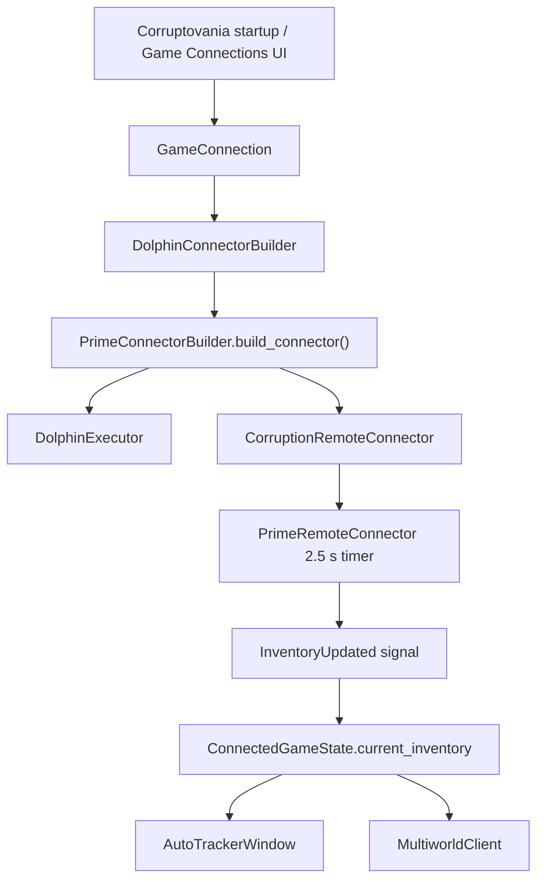
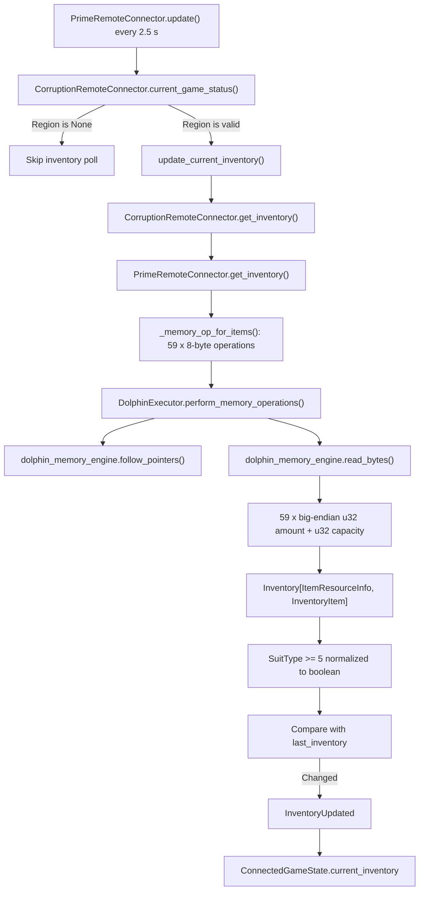
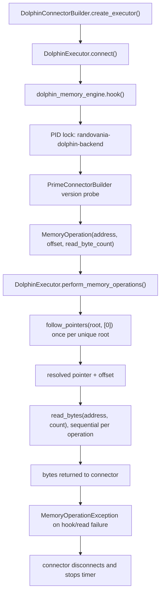
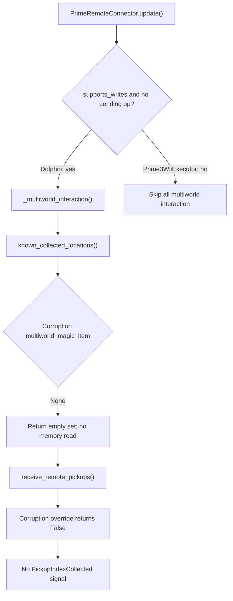
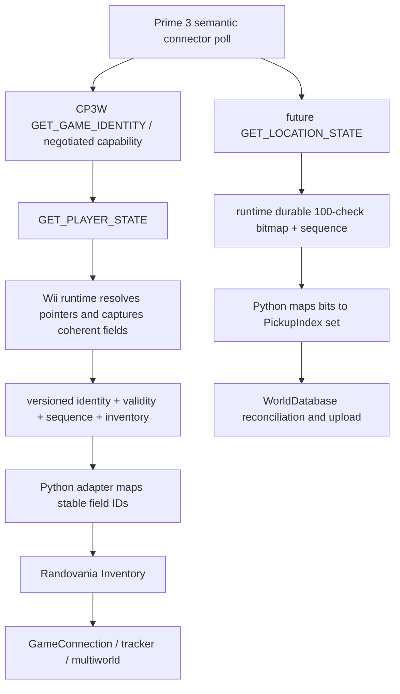

# Prime 3 Wii Dolphin State Acquisition Pipeline

## 1. Executive summary

Corruptovania already acquires Metroid Prime 3 inventory through the same Prime-family connector used by the auto tracker and multiworld client. The legacy Dolphin path is:

```text
GameConnection / UI setup
  -> DolphinConnectorBuilder
  -> PrimeConnectorBuilder.build_connector()
  -> CorruptionRemoteConnector
  -> PrimeRemoteConnector.update() every 2.5 seconds
  -> CorruptionRemoteConnector.current_game_status()
  -> PrimeRemoteConnector.update_current_inventory()
  -> CorruptionRemoteConnector.get_inventory()
  -> PrimeRemoteConnector.get_inventory()
  -> CorruptionRemoteConnector._memory_op_for_items()
  -> DolphinExecutor.perform_memory_operations()
  -> dolphin_memory_engine.follow_pointers() / read_bytes()
  -> 59 big-endian (amount, capacity) pairs
  -> Inventory[ItemResourceInfo, InventoryItem]
  -> InventoryUpdated -> GameConnection.current_inventory
  -> auto tracker and MultiworldClient
```

The executor boundary is **A/B, raw bytes plus address-aware memory operations**, not a semantic game-state boundary. `CorruptionRemoteConnector` owns the Prime 3 structure knowledge and converts raw bytes into Randovania inventory. The new `Prime3WiiExecutor` deliberately emulates this same `MemoryOperationExecutor` interface over CP3W `READ_MEMORY`, so it currently preserves the old address-coupled boundary.

Prime 3 collected-location acquisition is **not implemented**. Corruption has no multiworld magic item, location bitmap, pickup flag reader, event-state reader, or delta detector. Its inherited `known_collected_locations()` returns an empty set without touching memory. The logic database does define exactly 100 semantic `PickupIndex` values, 0 through 99, but those are placement identifiers, not live state.

The recommended future boundary is a small set of versioned semantic snapshots: `GET_GAME_IDENTITY`, `GET_PLAYER_STATE` (including inventory and validity metadata), and later `GET_LOCATION_STATE` with a full bitmap plus monotonic sequence. The Wii runtime should resolve volatile pointers and capture coherent game structures. Python should map stable wire field IDs into `ItemResourceInfo`, `Inventory`, `PickupIndex`, persistence, UI, and multiworld messages.

## 2. Repository state

Preflight was recorded before analysis on 2026-07-17.

| Property | Value |
|---|---|
| Repository | `C:\Users\Reed Whaley\Documents\MP3 Networking` |
| Branch | `prime3-wii-networking` |
| HEAD | `8fbbaba9a07d492ea02c8e0ccc6a6dbb3ad11bdd` (`Add Prime 3 CP3W session negotiation`) |
| Tracking state | `origin/prime3-wii-networking`, ahead 4 |
| Worktree | Clean |
| Index | Clean |
| `git diff --check` | Passed |
| Starting diff stat/name status | Empty |

No implementation, runtime C, protocol definition, test, staging, commit, or push was performed for this investigation. This document is the only intended worktree addition.

## 3. High-level architecture

The application creates one global `GameConnection` and one `MultiworldClient`. Configured `ConnectorBuilderOption` values reconstruct a backend such as `DolphinConnectorBuilder` or `Prime3WiiConnectorBuilder`. `GameConnection` tries disconnected builders every 2.5 seconds. Once a Prime game is identified by its build string, the builder starts the connector's own 2.5-second timer.



The backend split is important:

| Backend | Builder | Executor | Semantic connector |
|---|---|---|---|
| Legacy emulator | `DolphinConnectorBuilder` | `DolphinExecutor` using Dolphin Memory Engine | `CorruptionRemoteConnector` |
| Current Wii/UDP compatibility path | `Prime3WiiConnectorBuilder` | read-only `Prime3WiiExecutor` using CP3W `READ_MEMORY` | the same `CorruptionRemoteConnector` |

The legacy Dolphin builder probes Prime 1, Echoes, and Corruption versions. The Wii builder narrows candidates to Corruption but otherwise reuses version identification and semantic decoding.

## 4. Complete inventory call chain

### 4.1 Startup and connection

| Step | Symbol | Input | Output/transformation | Next step |
|---|---|---|---|---|
| 1 | `randovania.gui.qt.run()` | persisted options and world database | creates global `GameConnection` and `MultiworldClient` | `GameConnection.__init__()` |
| 2 | `GameConnection.__init__()` | `options.connector_builders` | reconstructs builders; creates a 2.5 s `_auto_update` timer | `GameConnection.start()` |
| 3 | `GameConnection._auto_update()` | builders without connectors | calls `builder.build_connector()` concurrently | `PrimeConnectorBuilder.build_connector()` |
| 4 | `DolphinConnectorBuilder.create_executor()` | none | `DolphinExecutor` | `executor.connect()` |
| 5 | `DolphinExecutor.connect()` | running Dolphin process | hooks Dolphin Memory Engine and claims a PID-file lock | version probe |
| 6 | `PrimeConnectorBuilder.build_connector()` | all Prime version candidates | reads first four build-string bytes, then full build string/UUID | selected `CorruptionRemoteConnector` |
| 7 | `PrimeRemoteConnector.check_for_world_uid()` | version build-string address and expected bytes | validates revision and extracts bytes 6..21 as layout UUID | `start_updates()` |
| 8 | `PrimeRemoteConnector.start_updates()` | selected connector | starts the connector's 2.5 s `InfiniteTimer` | `update()` |

### 4.2 Poll and decode

| Step | Symbol | Input | Output/transformation | Next step |
|---|---|---|---|---|
| 1 | `InfiniteTimer._on_timeout()` | 2.5 s interval | creates one async `PrimeRemoteConnector.update()` task; schedules the next interval after completion | `update()` |
| 2 | `PrimeRemoteConnector.update()` | connected Dolphin executor | revalidates build string/UUID for Dolphin; obtains pending-operation and current region | `current_game_status()` |
| 3 | `CorruptionRemoteConnector.current_game_status()` | version roots | reads world asset ID, pending-operation byte, player pointer, and CPlayer vtable | `(has_pending_op, Region | None)` |
| 4 | `PrimeRemoteConnector.update()` | non-`None` region | calls `update_current_inventory()`; skips inventory at title/loading/invalid-player state | inventory poll |
| 5 | `PrimeRemoteConnector.update_current_inventory()` | previous `last_inventory` | calls `get_inventory()`, compares complete `Inventory`, emits only on change | `InventoryUpdated` |
| 6 | `CorruptionRemoteConnector.get_inventory()` | none | delegates generic decode, then normalizes `SuitType >= 5` to `(True, True)` | semantic inventory |
| 7 | `PrimeRemoteConnector.get_inventory()` | all game items whose `item_id < 1000` | obtains memory operations, reads bytes, unpacks each as `>II`, validates amount/capacity | `Inventory` |
| 8 | `CorruptionRemoteConnector._memory_op_for_items()` | 59 `ItemResourceInfo` values | resolves game-state owner and builds one 8-byte operation per powerup slot | executor |
| 9 | `DolphinExecutor.perform_memory_operations()` | `MemoryOperation[]` | follows each unique pointer root once, then performs operations sequentially | native DME calls |
| 10 | `dolphin_memory_engine` native extension | emulated MEM1 address/size | `follow_pointers(root, [0])`, then `read_bytes(address, size)` | raw `bytes` |
| 11 | `RemoteConnector.InventoryUpdated` | `Inventory` | Qt signal | `GameConnection._on_inventory_updated()` |
| 12 | `GameConnection._on_inventory_updated()` | connector and inventory | replaces `ConnectedGameState.current_inventory`; emits `GameStateUpdated` | tracker/multiworld |
| 13 | `AutoTrackerWindow.on_game_state_updated()` | connected state | calls `ItemTrackerWidget.update_state()` | visible tracker |
| 14 | `MultiworldClient._create_new_sync_request()` | connected state | encodes item short name to **capacity** only | server world sync |



## 5. Complete Dolphin memory-read chain

`DolphinExecutor` imports `dolphin_memory_engine` 1.3.1. This is a native Python extension described by its installed metadata as hooking a running Dolphin process and reading/writing emulated memory. It is not HTTP, TCP, UDP, a named pipe exposed by this repository, or Dolphin's debugger API. The repository-facing API is synchronous `hook`, `is_hooked`, `follow_pointers`, `read_bytes`, `write_bytes`, and `un_hook`, wrapped in async methods that do not offload to a worker thread.



### Lifecycle and failure behavior

- macOS is rejected explicitly. The installed native package supports x86-64 Windows/Linux in its metadata; frozen Linux availability has additional root/Flatpak restrictions in `ConnectorBuilderChoice.is_usable()`.
- only one Corruptovania instance may own the Dolphin backend PID lock.
- `is_connected()` performs a four-byte test read before trusting an existing hook.
- all ranges must be within `0x80000000..0x81800000` (MEM1).
- pointer failures omit the affected result after checking whether the hook remains valid.
- native `RuntimeError` becomes `MemoryOperationException`; `PrimeRemoteConnector.update()` disconnects and stops its timer.
- reads are sequential and independently coherent. There is no emulator pause, lock, transaction, generation counter, or snapshot boundary.
- `perform_memory_operations()` batches only pointer-root resolution. It does not batch the actual byte reads.

## 6. Inventory field map

For every row below:

- `G = big_endian_u32(memory[version.game_state_pointer:4])`
- `P = big_endian_u32(memory[G + 0x24:4])`
- raw slot address is `P + 0x54 + item_id * 0x0c`
- width is 8 bytes, decoded as unsigned big-endian `>II`
- output is `InventoryItem(amount:u32, capacity:u32)` keyed by the named `ItemResourceInfo`
- no mask, shift, sign extension, or inferred maximum is applied
- confidence is high because connector code, resource definitions, and the synthetic integration fixture agree

| Semantic field (`short_name`) | ID | Max | Raw address | Transformation / notes | Confidence |
|---|---:|---:|---|---|---|
| Power Beam (`PowerBeam`) | 0 | 1 | `P+0x54` | direct amount/capacity | High |
| Plasma Beam (`PlasmaBeam`) | 1 | 1 | `P+0x60` | direct ownership pair | High |
| Nova Beam (`NovaBeam`) | 2 | 1 | `P+0x6c` | direct ownership pair | High |
| Charge Beam (`ChargeUpgrade`) | 3 | 1 | `P+0x78` | direct ownership pair | High |
| Missile (`Missile`) | 4 | 255 | `P+0x84` | current missiles and missile capacity | High |
| Ice Missile (`IceMissile`) | 5 | 1 | `P+0x90` | direct ownership pair | High |
| Seeker Missile (`Seekers`) | 6 | 1 | `P+0x9c` | direct ownership pair | High |
| Grapple Lasso (`GrappleBeamPull`) | 7 | 1 | `P+0xa8` | direct ownership pair | High |
| Grapple Swing (`GrappleBeamSwing`) | 8 | 1 | `P+0xb4` | direct ownership pair | High |
| Grapple Voltage (`GrappleBeamVoltage`) | 9 | 1 | `P+0xc0` | direct ownership pair | High |
| Morph Ball Bomb (`Bomb`) | 10 | 1 | `P+0xcc` | direct ownership pair | High |
| Combat Visor (`CombatVisor`) | 11 | 1 | `P+0xd8` | direct ownership pair | High |
| Scan Visor (`ScanVisor`) | 12 | 1 | `P+0xe4` | direct ownership pair; not scan completion flags | High |
| Command Visor (`CommandVisor`) | 13 | 1 | `P+0xf0` | direct ownership pair | High |
| X-Ray Visor (`XRayVisor`) | 14 | 1 | `P+0xfc` | direct ownership pair | High |
| Space Jump Boots (`DoubleJump`) | 15 | 1 | `P+0x108` | direct ownership pair | High |
| Screw Attack (`ScrewAttack`) | 16 | 1 | `P+0x114` | direct ownership pair | High |
| Suit Type (`SuitType`) | 17 | 6 | `P+0x120` | generic decode first; Corruption then emits boolean `(raw >= 5, raw >= 5)` | High |
| Energy (`Energy`) | 18 | 1499 | `P+0x12c` | current energy and maximum energy units | High |
| Hypermode Energy (`HypermodeEnergy`) | 19 | 0 | `P+0x138` | direct pair; max definition is zero, so any positive capacity fails validation | High |
| Energy Tank (`EnergyTank`) | 20 | 14 | `P+0x144` | amount/capacity tank counter | High |
| Item Percentage (`ItemPercentage`) | 21 | 255 | `P+0x150` | direct game counter; not used as collected-location state | High |
| Energy Cells Total (`Fuses`) | 22 | 9 | `P+0x15c` | total cell counter | High |
| Energy Cell 1 (`Fuse1`) | 23 | 1 | `P+0x168` | individual ownership pair | High |
| Energy Cell 2 (`Fuse2`) | 24 | 1 | `P+0x174` | individual ownership pair | High |
| Energy Cell 3 (`Fuse3`) | 25 | 1 | `P+0x180` | individual ownership pair | High |
| Energy Cell 4 (`Fuse4`) | 26 | 1 | `P+0x18c` | individual ownership pair | High |
| Energy Cell 5 (`Fuse5`) | 27 | 1 | `P+0x198` | individual ownership pair | High |
| Energy Cell 6 (`Fuse6`) | 28 | 1 | `P+0x1a4` | individual ownership pair | High |
| Energy Cell 7 (`Fuse7`) | 29 | 1 | `P+0x1b0` | individual ownership pair | High |
| Energy Cell 8 (`Fuse8`) | 30 | 1 | `P+0x1bc` | individual ownership pair | High |
| Energy Cell 9 (`Fuse9`) | 31 | 1 | `P+0x1c8` | individual ownership pair | High |
| Morph Ball (`MorphBall`) | 32 | 1 | `P+0x1d4` | direct ownership pair | High |
| Boost Ball (`BoostBall`) | 33 | 1 | `P+0x1e0` | direct ownership pair | High |
| Spider Ball (`SpiderBall`) | 34 | 1 | `P+0x1ec` | direct ownership pair | High |
| Hypermode Tank (`HyperModeTank`) | 35 | 1 | `P+0x1f8` | direct ownership pair | High |
| Hypermode Beam (`HyperModeBeam`) | 36 | 1 | `P+0x204` | direct ownership pair | High |
| Hyper Missile (`HyperModeMissile`) | 37 | 1 | `P+0x210` | direct ownership pair | High |
| Hyper Ball (`HyperModeBall`) | 38 | 1 | `P+0x21c` | direct ownership pair | High |
| Hyper Grapple (`HyperModeGrapple`) | 39 | 1 | `P+0x228` | direct ownership pair | High |
| Hypermode Permanent (`HyperModePermanent`) | 40 | 1 | `P+0x234` | direct ownership pair | High |
| Hypermode Phaaze (`HyperModePhaaze`) | 41 | 1 | `P+0x240` | direct ownership pair | High |
| Hypermode Original (`HyperModeOriginal`) | 42 | 1 | `P+0x24c` | direct ownership pair | High |
| Ship Grapple (`ShipGrapple`) | 44 | 1 | `P+0x264` | ID 43 is absent from the resource database | High |
| Ship Missile (`ShipMissile`) | 45 | 11 | `P+0x270` | current ship missiles and capacity | High |
| Face Corruption Level (`FaceCorruptionLevel`) | 46 | 4 | `P+0x27c` | direct counter | High |
| Cannon Ball (`CannonBall`) | 48 | 1 | `P+0x294` | ID 47 is absent | High |
| Activate Morphball Boost (`ActivateMorphballBoost`) | 49 | 1 | `P+0x2a0` | direct state pair | High |
| Hyper Shot (`HyperShot`) | 50 | 2 | `P+0x2ac` | direct level pair | High |
| Command Visor Jammed (`CommandVisorJammed`) | 51 | 1 | `P+0x2b8` | direct state pair | High |
| Energy Cells Used (`EnergyCellsUsed`) | 52 | 9 | `P+0x2c4` | direct counter | High |
| Enemies Killed (`Stat_EnemiesKilled`) | 62 | 99999 | `P+0x33c` | statistics counter | High |
| Shots Fired (`Stat_ShotsFired`) | 63 | 99999 | `P+0x348` | statistics counter | High |
| Damage Received (`Stat_DamageReceived`) | 64 | 99999 | `P+0x354` | statistics counter | High |
| Data Saves (`Stat_DataSaves`) | 65 | 99999 | `P+0x360` | statistics counter | High |
| Hypermode Uses (`Stat_HypermodeUses`) | 66 | 99999 | `P+0x36c` | statistics counter | High |
| Commando Kills (`Stat_CommandoKills`) | 67 | 99999 | `P+0x378` | statistics counter | High |
| Tin Can High Score (`Stat_TinCanHighScore`) | 68 | 99999 | `P+0x384` | statistics counter | High |
| Tin Can Current Score (`Stat_TinCanCurrentScore`) | 69 | 99999 | `P+0x390` | statistics counter | High |

Four logical resources are intentionally excluded because their `item_id >= 1000`: `MissileLauncher`, `ShipMissileLauncher`, `TemporaryMissile`, and `TemporaryShipMissile`. They are not inferred from the corresponding ammo values. No artifact resource exists for Prime 3; Energy Cells are represented by the total plus nine individual cell resources.

Ownership is not globally converted to booleans. Most one-capacity resources retain integer `(amount, capacity)` values. Progressive state is represented as the capacity/level of named resources, not as a separate progressive-item enum. Host pickup-grant planning can apply conditional/conversion logic through `PickupEntry`, but that is not part of state acquisition. The offline C# `MP3Inventory` class describes starting-inventory patch input and is not used by this live read path.

## 7. Address and pointer provenance

### Region/revision roots

These constants come from installed `open-prime-rando` 0.20.1 `corruption/dol_versions.py`, selected by exact build string. The layout UUID may replace bytes 6..21 while the remainder must match.

| Use | Wii NTSC | Wii PAL | Wii NTSC-J | Direct/pointer | Validation and stability |
|---|---:|---:|---:|---|---|
| build string | `0x805822b0` | `0x805843a8` | `0x80587c2c` | direct | exact 57-byte revision string with UUID window; high confidence, revision-specific |
| game-state pointer root | `0x8067dc0c` | `0x80680234` | `0x80683a7c` | pointer | selected only after build match; volatile target, root revision-specific |
| CStateManager global | `0x805c4f70` | `0x805c7570` | `0x805caa30` | mixed direct/pointer | selected only after build match; revision-specific |
| CPlayer vtable | `0x80592c78` | `0x80595238` | `0x80598650` | expected direct value | validates that a live CPlayer is present; revision-specific |

### Structure offsets

| Semantic use | Address/path | Definition | Validation | Stability risk |
|---|---|---|---|---|
| current world asset ID | `*(game_state_pointer) + 0x08`, 8 bytes | `CorruptionRemoteConnector.current_game_status()` | decoded `>Q`, matched to `Region.extra["asset_id"]` | hard-coded structure offset; revision roots vary but offset assumed common |
| powerup-vector pointer member | `*(game_state_pointer) + 0x24` | `_memory_op_for_items()` | non-null only by assertion/result availability | hard-coded structure offset; medium/high risk across revisions |
| powerup array data start | `*(*(game_state_pointer)+0x24) + 0x54` | `_corruption_powerup_offset()` | per-field capacity sanity checks | hard-coded vector/object layout |
| powerup stride | `0x0c` | `_corruption_powerup_offset()` | no structural signature | hard-coded entry layout |
| pending remote operation | `cstate_manager_global + 0x02`, 1 byte | `current_game_status()` | zero/nonzero only | patch coordination field; not inventory validity |
| CStateManager owner | pointer at `cstate_manager_global + 0x28` | `current_game_status()` | pointer-follow failure produces no player | hard-coded layout |
| CPlayer pointer | `*(cstate_manager_global+0x28) + 0x2184` | `current_game_status()` | pointed object vtable must equal version constant | source contains TODO noting an extra pointer indirection |
| item slot | powerup data + `item_id * 0x0c` | Prime 3 `header.json` item `extra.item_id` | `amount <= capacity <= max_capacity`, except absent magic item allowance | item IDs are game-specific and assumed stable |
| world identity | build string bytes 6..21 | Prime connector patch convention | rest of build string exact | stable only for patched/known DOL convention |

No signature scan, symbol map, runtime manifest, save-structure schema, or DOL-derived metadata is consulted at runtime. The address roots are external hard-coded version records; structure offsets are hard-coded connector constants; item IDs are repository game-description data.

## 8. Raw-byte decoding rules

- Wii values are decoded big-endian.
- world IDs use `struct.unpack(">Q")` (unsigned 64-bit).
- pointers and vtables use `>I` or `int.from_bytes(..., "big")` (unsigned 32-bit).
- each inventory slot uses `struct.unpack(">II")`: unsigned 32-bit current amount, then unsigned 32-bit capacity.
- the pending-operation flag is one byte, where any nonzero value is true.
- there are no bit masks, shifts, signed values, packed bitfields, or arrays decoded by the inventory path.
- invalid `amount > capacity` or `capacity > ItemResourceInfo.max_capacity` raises `MemoryOperationException`.
- the only post-decode Prime 3 normalization is `SuitType`: both output values become booleans indicating whether the raw values are at least 5.

### Semantic model boundary

The semantic boundary is therefore between **B and C**: the executor returns raw bytes for typed address operations; the game connector returns game-semantic `Inventory`. `GameConnection` then normalizes transport differences by storing the common Randovania `Inventory` model (boundary D for consumers).

Consequences:

- Dolphin and current Wii UDP executors can share connector logic.
- every executor must expose raw game addresses and pointer semantics.
- host code is coupled to retail revision roots and in-memory C++ layouts.
- sequential reads can combine values from different game frames.
- a runtime-side semantic snapshot can replace the executor without changing `Inventory`, `GameConnection`, tracker, or multiworld consumers if an adapter remains at the connector boundary.

## 9. Existing check/location-state behavior

Prime 3 check acquisition is absent.



The generic Prime implementation can use a patched "multiworld magic item" as a one-entry mailbox: positive `amount` encodes `PickupIndex(amount - 1)`, and a remote code patch clears it. Corruption explicitly returns `None`, so this mechanism does not exist for Prime 3. Corruption also overrides remote pickup delivery to return `False` and remote patch execution to raise.

What exists instead:

- the logic database contains exactly 100 unique `pickup_index` values, 0..99;
- patcher data knows MREA IDs, SCLY sections, instance IDs, percentage-pickup IDs, memo IDs, and relays for modifying pickup objects offline;
- one logic event named `Temple of Bryyo Gel Pickup Collected` exists for logic evaluation, not runtime telemetry;
- `ConnectedGameState.collected_indices`, `PickupIndexCollected`, `WorldData.collected_locations`, upload deduplication, and persistence are generic infrastructure ready to consume semantic IDs.

There is no current read of a location bitmap, individual pickup flags, event flags, world/area state flags, scan completion, save-file state, entity active state, or patch-injected Prime 3 mailbox. `ItemPercentage` is merely an inventory counter and is not mapped to specific checks.

The closest support for future discovery is the offline MREA/instance mapping plus the contiguous semantic `PickupIndex` set. Neither proves which durable runtime/save flags correspond to each check.

## 10. Existing multiworld integration

### Implemented generic behavior

1. `InventoryUpdated` changes `ConnectedGameState.current_inventory`.
2. `MultiworldClient` serializes inventory by `ItemResourceInfo.short_name`, using **capacity only**.
3. `PickupIndexCollected` adds to an in-memory set in `ConnectedGameState`.
4. `MultiworldClient.on_game_state_updated()` merges indices into persistent `WorldData.collected_locations`.
5. `WorldDatabase.get_locations_to_upload()` subtracts `uploaded_locations`, providing host-side deduplication.
6. successful server sync extends `uploaded_locations`; failed uploads remain pending across reconnect/restart.
7. network pickup updates call `RemoteConnector.set_remote_pickups()` with an ordered tuple.

### Prime 3 status

| Concern | Status | Evidence |
|---|---|---|
| local inventory changes | Implemented | full snapshot diff in `update_current_inventory()` |
| local check detection | Absent | `multiworld_magic_item is None`; no other reader |
| local check persistence/upload | Generic infrastructure implemented, but receives no Prime 3 events | `GameConnection`, `WorldDatabase`, `MultiworldClient` |
| remote item queue | Host tuple accepted by inherited setter | `set_remote_pickups()` stores tuple |
| remote item grant | Absent for Corruption | override returns `False`; UDP executor is read-only |
| grant acknowledgement | Absent | no Prime 3 grant command/state |
| duplicate grant prevention | Generic Prime magic capacity design exists for other games; absent for Corruption | no Corruption magic resource or grant execution |
| reconnect inventory recovery | Snapshot naturally reread | no explicit generation/save identity |
| reconnect check recovery | Host persistence exists; game-side source absent | no bitmap/snapshot to reconcile |

The current system assumes addressable memory for Prime connectors, but game-independent signals and models already isolate the UI/server layers from the emulator.

## 11. Emulator-specific responsibilities

- discovering and hooking a running Dolphin process;
- enforcing a single backend owner with a PID file;
- checking hook liveness;
- translating `MemoryOperation` into DME pointer follows, reads, and writes;
- validating MEM1 ranges;
- surfacing Dolphin status and disconnect errors;
- platform restrictions (no macOS; frozen Linux restrictions).

These belong exclusively to `DolphinExecutor`. No inventory field meaning is emulator-specific.

## 12. Prime 3-specific responsibilities

- selecting Corruption versions and their build strings/address roots;
- the game-state, CStateManager, CPlayer, powerup-vector, and slot offsets;
- 64-bit world asset IDs and region lookup;
- CPlayer vtable validity check;
- item IDs, max capacities, names, and semantic resource database;
- 59-field selection (`item_id < 1000`);
- `SuitType >= 5` normalization;
- the explicit absence of a magic multiworld item and remote patch path;
- offline pickup object identifiers and the 0..99 semantic location namespace.

## 13. Generic Randovania responsibilities

- builder lifecycle and backend selection;
- `MemoryOperationExecutor` abstraction;
- timer scheduling and connector disconnect lifecycle;
- `Inventory`, `InventoryItem`, `ItemResourceInfo`, and `PickupIndex` models;
- Qt signals for player location, inventory, and collected checks;
- `ConnectedGameState` aggregation;
- tracker rendering;
- inventory serialization by short name/capacity;
- collected-location persistence, upload deduplication, retries, and server sync;
- remote pickup queue delivery to a game connector.

## 14. Runtime versus host responsibilities

### Should move into the Wii runtime

- identify the supported game build/revision and expose a stable identity;
- resolve volatile game-state/player-state pointers;
- validate gameplay/save-loaded state;
- read the complete powerup structure as one coherent snapshot;
- discover and read durable location/check state once its structure is proven;
- attach a monotonic state sequence and validity flags;
- maintain enough compact state for reconnect reconciliation.

These operations are volatile, address-coupled, and benefit from execution synchronized with the game.

### Must remain on the host

- map stable protocol field IDs to `ItemResourceInfo` and `InventoryItem`;
- retain game-description max-capacity/domain validation as a second line of defense;
- apply tracker-specific presentation such as suit normalization if the wire format exposes raw semantic levels;
- map stable location bits/IDs to `PickupIndex` and placement data;
- persist/upload collected checks and deduplicate server delivery;
- multiworld session coordination, remote pickup ordering, UI, logging, and user-facing errors;
- negotiate protocol/capabilities and adapt protocol versions.

### Could exist on either side

- `SuitType` thresholding: runtime normalization simplifies hosts, but preserving a typed suit level is more informative and avoids losing game state. Prefer a typed level on wire and host mapping.
- max-capacity validation: runtime should validate structural plausibility; host should validate Randovania domain limits.
- change detection: runtime sequencing/deltas reduce traffic, while host comparison remains useful for UI and backward compatibility.
- location delta tracking: runtime can emit compact changes, but host must retain a full reconciled set.

The narrowest stable boundary is a versioned semantic state structure, not arbitrary memory and not fully serialized Randovania classes.

## 15. Polling and performance characteristics

### Existing Dolphin path

- connector interval: 2.5 seconds, measured from completion to the next schedule;
- `InfiniteTimer` prevents overlapping non-strict tasks;
- inventory polling occurs only when `current_game_status()` resolves a known world and valid CPlayer vtable;
- unchanged inventory is suppressed at `PrimeRemoteConnector`; no `InventoryUpdated` signal is emitted;
- the executor does not cache inventory or prior bytes; the connector caches the last semantic `Inventory`;
- Dolphin-specific update revalidates the 57-byte build string/UUID every poll;
- no explicit loading/death/save/savestate state machine exists.

A normal in-game Dolphin poll performs approximately:

| Component | Native calls | Payload bytes visible/implicit |
|---|---:|---:|
| build identity | 1 `read_bytes` | 57 |
| status roots/fields | 2 `follow_pointers`, 4 `read_bytes` | about 25 including 8 pointer bytes internal to follows |
| inventory root setup | 1 direct `read_bytes`, 1 `follow_pointers` | about 8 including 4 pointer bytes internal to follow |
| inventory fields | 59 `read_bytes` | 472 |
| **Approximate total** | **68 native API calls** | **about 562 bytes** |

The byte estimate counts four bytes per pointer follow; the native extension does not expose its internal read accounting, so it is approximate. The important performance fact is 59 independent field reads, not byte volume. Values are not atomic: the game may advance between any two reads.

The current CP3W compatibility executor is more expensive: it serializes operations, and every pointer-offset `MemoryOperation` performs a separate UDP read for the pointer followed by a separate UDP read for the field. The same inventory poll therefore produces many request/response exchanges. This is a migration bridge, not the recommended steady-state protocol.

### Future traffic estimates

| State | Concrete basis | Suggested representation | Approximate semantic payload |
|---|---|---|---:|
| current raw inventory | 59 pairs of u32 | unchanged raw pairs | 472 bytes plus framing |
| compact typed inventory | 59 fields, many boolean/small counters | fixed schema with u8/u16/u32 as needed | roughly 80-160 bytes; exact schema not yet defined |
| full Prime 3 location bitmap | 100 indices | 13 bytes bitmap plus identity/sequence | about 25-40 bytes plus CP3W framing |
| location deltas | usually one pickup | sequence + one u16 index/state | about 8-16 bytes plus framing |

At 2.5-second polling, even full semantic snapshots are low bandwidth. Correctness, coherence, reconnect recovery, and revision isolation matter more than payload size. A full location bitmap should remain available even if deltas are added.

### Transition behavior

| Situation | Current observed/code-defined behavior |
|---|---|
| title screen / no save | unknown world, missing player, or wrong vtable yields `Region=None`; inventory is not read |
| loading/room transition | likely temporary `Region=None` or pointer failure; no explicit debounce; previous inventory remains cached |
| death/reload | next valid snapshot is compared and emitted if different; no death identity |
| save reload/new game | rereads memory, but no save identity or generation; same layout UUID remains |
| Dolphin savestate load | inventory rewind can be emitted; host collected-location set would remain monotonic if Prime 3 ever emitted events |
| disconnect | `MemoryOperationException` disconnects executor and stops connector timer; `GameConnection` later removes/rebuilds it |

Loading/death/savestate statements beyond the explicit control flow remain untested in live Dolphin.

## 16. Current test coverage

Focused tests run for this investigation:

```text
python -m pytest -q \
  test/game_connection/connector/test_corruption_remote_connector.py \
  test/game_connection/executor/test_dolphin_executor.py \
  test/game_connection/builder/test_prime_connector_builder.py \
  test/game_connection/connector/test_prime3_wii_corruption_integration.py \
  test/game_connection/test_game_connection.py \
  test/gui/test_multiworld_client.py

40 passed, 26 skipped in 5.32s
```

The 26 skips came from tests using this environment's `skip_qtbot` fixture (including parameterized cases); pytest reported their reason only as `Skipped`. No failure occurred.

| Test file / symbols | Covered behavior | Mocked layer | Real layer | Missing coverage |
|---|---|---|---|---|
| `test_corruption_remote_connector.py::test_fetch_game_status` | world/pending/player/vtable combinations | executor | Corruption decode/status logic | actual Dolphin pointers; inventory field map |
| `test_corruption_remote_connector.py::test_multiworld_magic_item_is_unavailable...` | no Corruption magic item | none | property | explicit assertion that `known_collected_locations()` reads nothing |
| `test_dolphin_executor.py::test_perform_memory_operations_*` | unique pointer follow, offsets, reads/writes, failures | native DME | executor orchestration/range logic | running Dolphin; coherent reads; version compatibility |
| `test_prime_connector_builder.py::*` | connection/version probing and candidate selection | executor | builder logic | direct Corruption-over-Dolphin integration |
| `test_prime3_wii_corruption_integration.py::test_read_only_update_flow` | synthetic pointer map, inventory diff, suit normalization | UDP server/memory image | builder + connector + protocol client | Dolphin executor; all 59 field values |
| `test_prime3_wii_corruption_integration.py::test_game_connection_inventory_path` | inventory reaches `ConnectedGameState` | fake runtime | connector and game-connection models/signals | tracker and multiworld serialization in same end-to-end test |
| `test_game_connection.py::test_connector_state_update` | signals update status, inventory, collected set | debug connector | generic aggregation | Prime 3-specific events |
| `test_multiworld_client.py::test_on_game_state_updated`, `test_create_new_sync_request`, `test_server_sync` | persistence, dedup, inventory/upload request, retries | network client | host state logic | Prime 3 location source and grant acknowledgement |

There is no live Dolphin test, snapshot-coherency test, loading/death/savestate test, region matrix inventory test, or Prime 3 location test because no location reader exists.

## 17. Gaps and unknowns

1. The durable Prime 3 save/world-state representation for each of the 100 checks is unknown.
2. The mapping from `PickupIndex` to a durable bit/flag is unknown; offline MREA/instance IDs alone do not establish it.
3. Whether all checks have durable save flags, or some require pickup/entity/event inference, is unknown.
4. Pointer validity during every loading/death/save transition has not been live-characterized.
5. The source TODO states the CPlayer path has an extra pointer indirection; current behavior works under tests but needs decompilation confirmation.
6. Suit values 0..6 and the reason for threshold 5 are not documented here; the current code intentionally discards lower levels.
7. `HypermodeEnergy` has `max_capacity=0`; any positive runtime value would be rejected. Whether that field is intentionally ignored-in-practice is untested.
8. The statistics fields are polled despite not appearing necessary for tracker or multiworld use.
9. No save identity distinguishes a new game, copied save, reload, or savestate under one layout UUID.
10. Physical Wii cache-coherency requirements for game/runtime shared state are not yet proven.

These do not block a read-only **game/runtime identity** milestone or an inventory snapshot using the already-proven powerup structure. They do block location snapshot/delta implementation.

## 18. Candidate CP3W service designs

| Option | Architecture fit | Coupling / portability | Complexity | Traffic | Testability / multiworld | Main failure mode | Assessment |
|---|---|---|---|---|---|---|---|
| A. Raw constrained memory reads | exact fit for current `MemoryOperationExecutor` | host owns all addresses; worst revision coupling | low runtime, high host | many round trips unless batching added | easy primitive tests; poor semantic contract | stale pointers, partial snapshots, host/runtime disagreement | useful bootstrap only; already implemented |
| B. Typed primitive field reads | adapter can still feed connector primitives | hides addresses but duplicates field IDs/decode rules | moderate on both sides | one request per field or custom batching | better validation; still weak reconciliation | field-set/version mismatch | improvement, but too granular |
| C. Structured `GET_PLAYER_STATE` | natural replacement for status + inventory poll | runtime owns volatile layout; stable host schema | moderate runtime/host | one compact snapshot | strong coherent tests; supports validity/save/sequence | schema version mismatch | **recommended umbrella** |
| D. Structured `GET_INVENTORY` | maps directly to `Inventory` adapter | runtime owns powerup layout | moderate; narrower than C | one snapshot | excellent tracker compatibility | separate status read can race | recommended as C substructure or first slice |
| E. Structured `GET_LOCATION_BITMAP` | maps to `PickupIndex` set | requires stable runtime mapping | moderate after discovery | about 13 bytes for 100 checks | ideal reconnect reconciliation | incorrect mapping silently reports checks | required after discovery |
| F. Structured `GET_LOCATION_DELTAS` | maps to signals efficiently | requires runtime history/sequence | higher runtime state | minimal | good live updates, insufficient alone after loss | dropped UDP delta / sequence gap | add only with bitmap fallback |
| G. Combined `GET_WORLD_STATE` | one coherent all-state snapshot | broad schema and revision adapter | highest initial complexity | still small | strongest reconciliation | one malformed field invalidates broad response | eventual option, not next milestone |

### Recommended command boundary

Use a structured `GET_PLAYER_STATE` response containing:

- game/build identity and schema version;
- validity flags (`gameplay_active`, `save_loaded`, `player_valid`);
- optional save identity when discovered;
- monotonic state sequence;
- current region/world semantic identity if stable;
- a versioned inventory substructure with stable field IDs and typed values.

Later add `GET_LOCATION_STATE` containing a full bitmap, mapping version, and the same save identity/state sequence. Optional deltas may optimize repeated polling, but the full snapshot is mandatory for reconnect and UDP loss recovery.

Do not expose arbitrary addresses in the semantic commands. Keep constrained `READ_MEMORY` as a diagnostic/development capability, not the gameplay service contract. Do not return serialized Python/Randovania objects; the runtime should expose game semantics, and the host adapter should construct domain models.



## 19. Recommended runtime/host boundary

The runtime should return **typed game semantics one level below Randovania models**. For inventory, that means stable protocol field IDs and typed values such as ownership, current count, capacity, and level. It should not return addresses or require Python to traverse pointers. It also should not know `ItemResourceInfo.short_name`, tracker themes, server payloads, or pickup placement.

The host should retain the existing `CorruptionRemoteConnector`-to-`Inventory` contract through a new semantic adapter. That preserves `GameConnection`, `AutoTrackerWindow`, `MultiworldClient`, persistence, and tests while allowing Dolphin and Wii backends to differ below the connector.

For Dolphin compatibility, either:

1. keep the existing Dolphin raw-memory decoder as a legacy implementation of the semantic adapter; or
2. eventually run the same injected CP3W runtime under Dolphin and use the Wii path.

The first is lower risk for migration; the second reduces duplicate address logic after physical-Wii validation.

## 20. Recommended capability model

Do not assign bit values in this discovery task. Recommended dependencies:

| Capability | Meaning | Depends on |
|---|---|---|
| `GAME_IDENTITY` | supported game, region/revision, runtime schema/build | HELLO/session |
| `PLAYER_STATE` | validity, sequence, region, inventory snapshot | `GAME_IDENTITY` |
| `INVENTORY_STATE` | inventory substructure if negotiated independently | `GAME_IDENTITY`; may be implied by `PLAYER_STATE` |
| `SAVE_IDENTITY` | stable save/new-game discriminator | `GAME_IDENTITY`; required before robust location reconciliation |
| `STATE_SEQUENCE` | monotonic snapshot/change sequence | `PLAYER_STATE`; required for deltas |
| `LOCATION_BITMAP` | full collected-check snapshot with mapping version | `GAME_IDENTITY`, preferably `SAVE_IDENTITY` |
| `LOCATION_DELTAS` | sequenced check changes | `LOCATION_BITMAP`, `STATE_SEQUENCE` |
| `ITEM_GRANTS` | idempotent semantic remote grants | `GAME_IDENTITY`, inventory semantics, session/save identity |

`LOCATION_DELTAS` must never be the only recovery mechanism. `ITEM_GRANTS` should remain out of scope until read-only identity, inventory, location mapping, and reconnect semantics are proven.

## 21. Proposed future milestone sequence

1. **Read-only game/runtime identity (next).** Return game, region/revision, runtime build/schema, gameplay/save validity, and a state sequence. Adapt it without changing inventory behavior.
2. **Structured inventory snapshot.** Capture the proven powerup table coherently in runtime and map it to the existing `Inventory` model; compare against legacy Dolphin reads in a live matrix.
3. **Location bitmap discovery and mapping.** Reverse-engineer durable save/world-state sources for all 100 `PickupIndex` values; document mixed flag/entity cases before protocol work.
4. **Location snapshot.** Implement a full mapping-versioned bitmap with save identity and host reconciliation.
5. **Location deltas and sequence handling.** Add optional deltas, gap detection, and automatic full-snapshot recovery.
6. **Reconnect and save/savestate reconciliation.** Prove new game, reload, death, copied save, Dolphin savestate, network loss, and runtime restart behavior.
7. **Remote item grant command.** Design typed resource grants only after inventory semantics are stable.
8. **Grant acknowledgement and idempotency.** Add durable grant IDs, replay handling, and save/session scoping.
9. **Physical Wii validation.** Prove cache coherency, timing, memory budget, network behavior, and recovery on hardware at every applicable milestone, with final end-to-end validation here.

The immediate next milestone should be **read-only game/runtime identity**, followed by the already-understood structured inventory snapshot. Location implementation must wait for mapping discovery.

## 22. Risk register

| Risk | Evidence | Impact | Mitigation | Blocks next milestone? |
|---|---|---|---|---|
| address instability | revision-specific roots in external constants | wrong reads/crash | runtime revision adapters plus identity; retain host sanity checks | No for identity; manage explicitly |
| region differences | NTSC/PAL/NTSC-J have different roots/vtables | one build works, others fail | test all three known build strings and live versions | No |
| game revision differences | only three exact builds listed | unsupported discs | reject unknown identity; add proven tables only | No |
| pointer lifetime | game/player pointers are volatile | null/stale/partial reads | runtime validity checks and same-frame snapshot | No |
| room transitions | polling has no explicit transition state | temporary invalid/mixed data | validity flags, sequence, debounce on host | No |
| save reload/new game | layout UUID does not identify save | stale collected state | discover `SAVE_IDENTITY` before locations | No for inventory; Yes for robust locations |
| death/reset | only next snapshot diff exists | transient or rollback state | characterize live; expose validity/generation | No |
| Dolphin savestates | inventory can rewind; host check set is monotonic | false reconciliation/duplicate grants | save/state generation plus full snapshots; explicit policy | Yes before grants |
| physical Wii cache coherency | runtime/game shared state not characterized | stale state | aligned buffers, cache maintenance, hardware proof | No for protocol design; required for deployment |
| partial reads | 59 independent Dolphin reads | inconsistent inventory | runtime single snapshot; sequence and validity | No |
| inconsistent snapshots | no pause/transaction | impossible amount/capacity combinations | structured atomic capture, retry invalid snapshots | No |
| runtime memory budget | high-MEM1 runtime is bounded | feature growth/collision | fixed compact schemas; manifest overlap validation | No |
| UDP payload limit | future state may grow | fragmentation/loss | compact structures, stay below path MTU, chunk only if proven necessary | No; 100-bit bitmap is tiny |
| location-ID mapping stability | PickupIndex is semantic; no live mapping | wrong check reports | versioned mapping artifact and exhaustive validation | Yes for location milestone |
| duplicate check reporting | host dedup exists, game source absent | duplicate uploads | full bitmap reconciliation plus sequence; keep host set persistence | Yes for deltas, not snapshot discovery |
| reconnect reconciliation | deltas can be lost | missing checks | mandatory full snapshots and host diff | Yes before delta-only behavior |
| remote item acknowledgement | absent for Corruption | duplicate/lost grants | idempotent grant IDs and durable acknowledgements | Yes before grants |
| protocol version mismatch | HELLO negotiates only current v1 behavior | semantic schema disagreement | capability plus structure version, explicit reject/fallback | No |
| suit normalization loss | host collapses raw levels >=5 | information loss | define typed suit level on wire; preserve current adapter output | No |
| zero-cap HypermodeEnergy | resource max is zero | valid positive state could disconnect | live characterize before snapshot schema finalization | No for identity; investigate for inventory |

## 23. Source index

Repository-relative references unless marked as installed dependency.

| File and lines | Symbol | Relevance |
|---|---|---|
| `randovania/gui/qt.py:284-299` | application setup | creates world database, global `GameConnection`, and `MultiworldClient` |
| `randovania/game_connection/game_connection.py:29-60` | `ConnectedGameState`, `GameConnection.__init__` | common state model and 2.5 s builder timer |
| `randovania/game_connection/game_connection.py:74-96` | `_auto_update()` | creates/reconnects remote connectors |
| `randovania/game_connection/game_connection.py:126-164` | signal handlers | converts connector signals into normalized connected state |
| `randovania/game_connection/builder/connector_builder_option.py:20-38` | `_CHOICE_TO_BUILDER`, `create_builder()` | persisted backend selection |
| `randovania/game_connection/builder/dolphin_connector_builder.py:13-22` | `DolphinConnectorBuilder` | selects `DolphinExecutor` |
| `randovania/game_connection/builder/prime3_wii_connector_builder.py:15-50` | `Prime3WiiConnectorBuilder` | alternate UDP executor and Corruption-only candidates |
| `randovania/game_connection/builder/prime_connector_builder.py:31-58` | `create_connector_candidates()` | legacy Dolphin considers Prime 1, Echoes, and Corruption versions |
| `randovania/game_connection/builder/prime_connector_builder.py:63-112` | `build_connector()` | connect, first-four-byte probe, full identity validation, timer start |
| `randovania/game_connection/connector/remote_connector.py:21-49` | `PlayerLocationEvent`, signals | generic connector event contract |
| `randovania/game_connection/connector/prime_remote_connector.py:56-77` | `PrimeRemoteConnector` | game/executor setup and 2.5 s connector timer |
| `randovania/game_connection/connector/prime_remote_connector.py:94-112` | `check_for_world_uid()` | exact build validation and layout UUID extraction |
| `randovania/game_connection/connector/prime_remote_connector.py:118-144` | `_current_status_world()` | world asset and CPlayer vtable semantic validation |
| `randovania/game_connection/connector/prime_remote_connector.py:159-177` | `get_inventory()` | 59 operation decode, `>II`, capacity validation, `Inventory` construction |
| `randovania/game_connection/connector/prime_remote_connector.py:179-211` | `known_collected_locations()` | generic magic-item mailbox; early empty return for Corruption |
| `randovania/game_connection/connector/prime_remote_connector.py:335-374` | `update()`, `update_current_inventory()` | polling gate, Dolphin identity recheck, diff and signal |
| `randovania/game_connection/connector/prime_remote_connector.py:376-415` | multiworld/update lifecycle | location signal, remote pickup attempt, timer/disconnect |
| `randovania/game_connection/connector/corruption_remote_connector.py:37-41` | `_corruption_powerup_offset()` | `0x54 + item_id * 0x0c` slot formula |
| `randovania/game_connection/connector/corruption_remote_connector.py:44-88` | `CorruptionRemoteConnector.current_game_status()` | world/pending/CPlayer read path |
| `randovania/game_connection/connector/corruption_remote_connector.py:90-110` | `_memory_op_for_items()` | game-state and powerup-vector pointer chain |
| `randovania/game_connection/connector/corruption_remote_connector.py:130-151` | no-op multiworld and `get_inventory()` | absent grants/check mailbox and suit threshold normalization |
| `randovania/game_connection/executor/memory_operation.py:7-68` | memory operation model/executor | raw address-plus-offset abstraction |
| `randovania/game_connection/executor/dolphin_executor.py:15-24` | MEM1 validation | allowed Dolphin range |
| `randovania/game_connection/executor/dolphin_executor.py:26-78` | lifecycle methods | DME hook, PID lock, liveness, disconnect |
| `randovania/game_connection/executor/dolphin_executor.py:81-139` | memory execution methods | pointer batching and sequential native reads/writes |
| `randovania/game_connection/executor/prime3_wii_executor.py:37-51` | UDP defaults/capabilities | current CP3W compatibility capability set |
| `randovania/game_connection/executor/prime3_wii_executor.py:103-208` | `Prime3WiiExecutor.connect()` | HELLO/session negotiation |
| `randovania/game_connection/executor/prime3_wii_executor.py:324-365` | raw read/memory operations | address-coupled UDP compatibility path |
| `randovania/game_description/resources/inventory.py:15-49` | `InventoryItem`, `Inventory` | normalized semantic inventory and capacity projection |
| `randovania/game_description/resources/item_resource_info.py:10-17` | `ItemResourceInfo` | item identity, max capacity, extra item ID |
| `randovania/game_description/resources/pickup_index.py:6-43` | `PickupIndex` | semantic location identifier |
| `randovania/games/prime3/logic_database/header.json:6-505` | Prime 3 item resources | names, max capacities, game item IDs; 59 live plus four excluded resources |
| `randovania/games/prime3/logic_database/*.json` | pickup nodes | exactly 100 unique semantic indices 0..99; not live state |
| `randovania/gui/auto_tracker_window.py:142-190` | `create_tracker()` | consumes connected inventory |
| `randovania/gui/auto_tracker_window.py:229-235` | `on_game_state_updated()` | pushes inventory changes to tracker widget |
| `randovania/gui/multiworld_client.py:82-130` | `_create_new_sync_request()` | encodes inventory and pending collected checks |
| `randovania/gui/multiworld_client.py:132-214` | `_server_sync()` | unchanged suppression, retry, upload acknowledgements |
| `randovania/gui/multiworld_client.py:222-235` | `on_game_state_updated()` | persists semantic check indices and supplies remote pickup queue |
| `randovania/network_common/remote_inventory.py:8-29` | remote inventory encoding | serializes short-name to capacity only |
| `randovania/interface_common/world_database.py:29-60` | `WorldData` | persistent collected/uploaded sets and deduplication |
| `randovania/interface_common/world_database.py:80-126` | persistence/query methods | durable JSON state and pending-upload calculation |
| `randovania/lib/infinite_timer.py:11-62` | `InfiniteTimer` | non-overlapping completion-relative async polling |
| `tools/prime3_patcher/MP3Randomizer/MP3Randomizer/PickupLocation.cs:3-38` | `PickupLocation` | offline MREA/SCLY/instance metadata, not runtime check state |
| `tools/prime3_patcher/MP3Randomizer/MP3Randomizer/PickupPatches.cs:1-280` | pickup patch generation | offline object modifications; closest location mapping evidence |
| `tools/prime3_patcher/MP3Randomizer/MP3Randomizer/MP3Inventory.cs:5-89` | `MP3Inventory` fields | offline starting-inventory model, not live acquisition |
| `test/game_connection/connector/test_corruption_remote_connector.py:18-65` | Corruption tests | no magic item and game-status decode |
| `test/game_connection/executor/test_dolphin_executor.py:21-200` | Dolphin executor tests | lifecycle, pointer/read/write calls, failure behavior |
| `test/game_connection/builder/test_prime_connector_builder.py:35-134` | Prime builder tests | identification and candidate behavior |
| `test/game_connection/executor/prime3_wii_fake_corruption_memory.py:20-90` | synthetic Corruption memory | executable pointer/offset model and item slot encoding |
| `test/game_connection/connector/test_prime3_wii_corruption_integration.py:48-115` | integration tests | update diff, suit normalization, disconnect, `GameConnection` inventory path |
| `test/game_connection/test_game_connection.py:152-192` | generic signal test | connected status/inventory/collected-state aggregation |
| `test/gui/test_multiworld_client.py:74-103` | state update test | persistent location merge and remote pickup queue |
| `test/gui/test_multiworld_client.py:120-306` | sync tests | inventory/check requests, retries, upload state |
| installed `open_prime_rando/dol_patching/corruption/dol_versions.py:10-69` | `ALL_VERSIONS` | NTSC/PAL/NTSC-J build strings, roots, vtables, patch function addresses |
| installed `dolphin_memory_engine/__init__.py:1-39` | native exports | exact Python-facing Dolphin Memory Engine functions |
